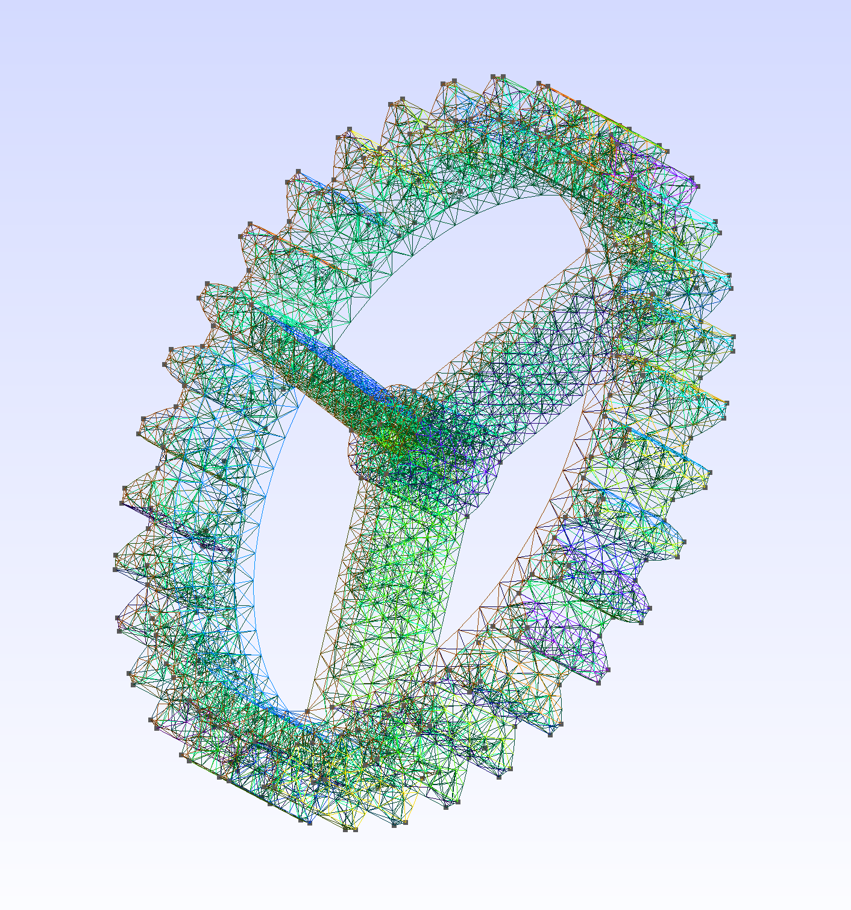
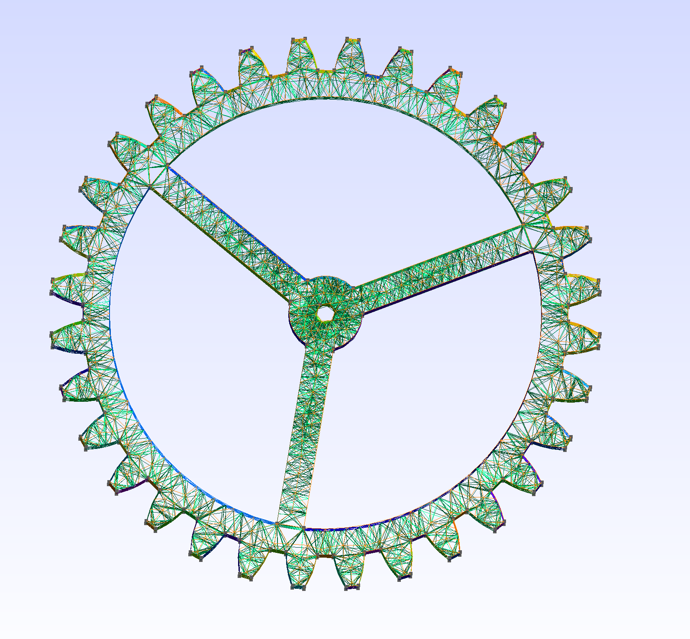
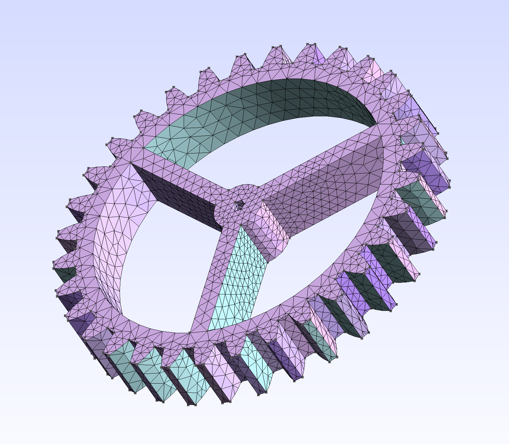
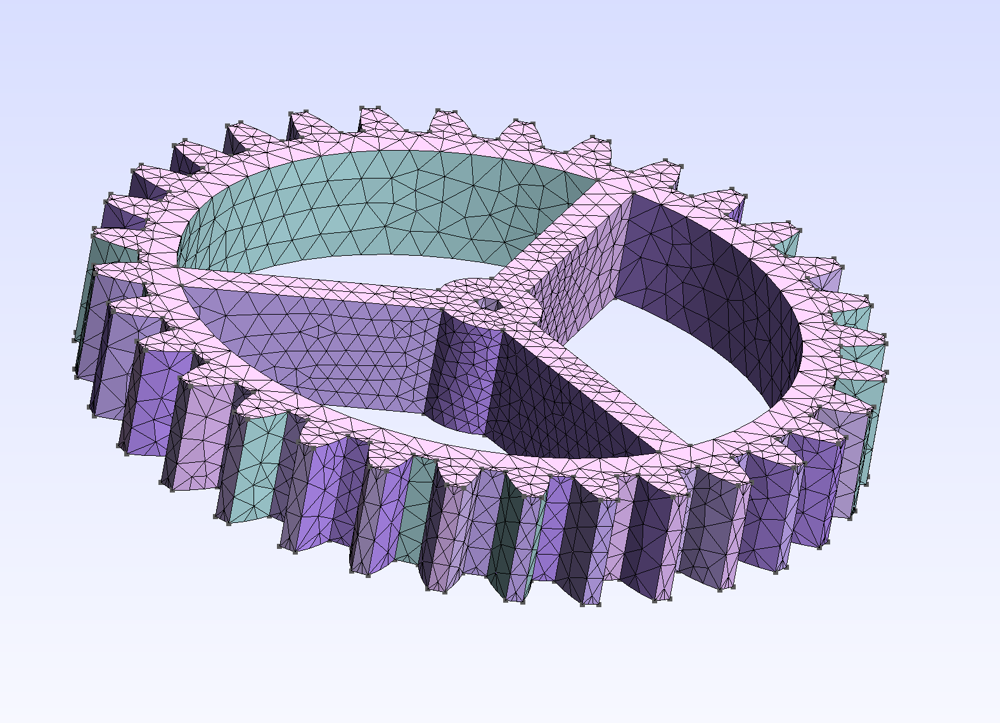
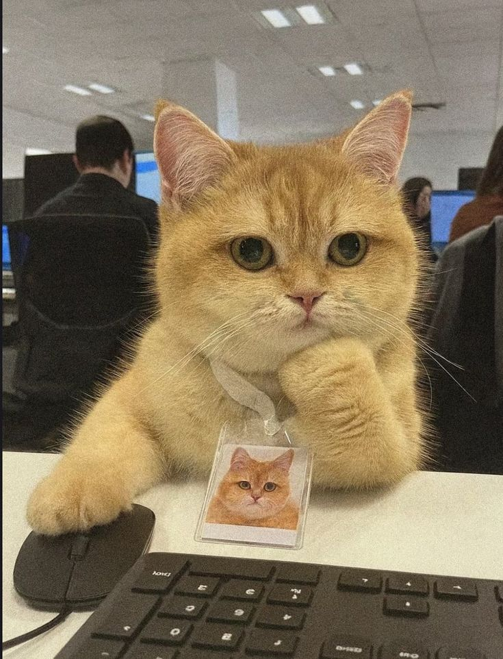

# Задание № 1: работа с геометрией и сетками в Gmsh.

В этой работе рассматривается построение трёхмерных сеток с использованием библиотеки **Gmsh**.
Основная цель — познакомиться с созданием геометрии и генерацией тетраэдральных сеток.

Стартер-код основан на примерах **t1** и **t13** из официального туториала Gmsh.

## Основные идеи

* сетки могут существенно отличаться в зависимости от задачи;
* в данной лабораторной используются **тетраэдральные сетки**, так как они позволяют заполнять области произвольной формы;
* другие типы объёмных элементов и продвинутые возможности мешеров в рамках этой базовой лабораторной не рассматриваются.

---

# Этап 1 — Тор (камера токамака)

Необходимо было построить **полый тор** и сгенерировать в нём тетраэдральную сетку.
Толщина стенки должна содержать **не менее 3–4 тетраэдров**.

Я реализовала **два варианта построения геометрии**:

1. **Более длинный вариант** — тор строится вручную из примитивов и операций вращения.
2. **Короткий вариант** — используется встроенная функция `addTorus`.

Первый вариант получился длиннее, потому что изначально я реализовала геометрию без встроенных методов. Позже я узнала о встроенной функции Gmsh и реализовала более компактный вариант. Для тренировки я решила оставить **оба решения**.

Код с использованием встроенного метода:

👾 [result_simple.cpp](code/result_simple.cpp)

Код с ручным построением геометрии:

👾 [result.cpp](code/result.cpp)

## Картинки построенных объектов:

  
  

  
  

  
  

---

# Этап 2 — Сетка для STL-модели

На этом этапе необходимо было:

* найти готовый **STL-файл** с геометрией;
* импортировать его в Gmsh;
* построить тетраэдральную сетку.

В качестве примера использовалась модель **шестерни**. Первоначально планировалось использовать модели bunny.stl или UtahTeapot.stl, однако для них не удалось корректно выполнить генерацию сетки.

Код для загрузки STL и генерации сетки:

👾  [gear_mesh.cpp](code/gear_mesh.cpp)

## Картинки построенных объектов:

  
  

  
  

---

   
  <em>котик наблюдает за генерацией сеток</em>

