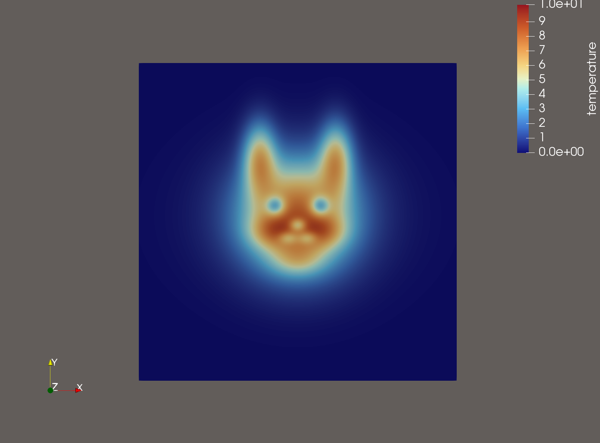

# Задание №3: Моделирование распространения тепла в FEniCS

В этой лабораторной я попробовала поработать с библиотекой **FEniCS** и посмотреть, как решаются задачи методом конечных элементов.

Я взяла пример **heat equation** и немного его изменила.  
Вместо стандартного начального распределения температуры я задала свою функцию — **кошачью мордочку**.

Идея была простая: задать начальное распределение температуры в виде рисунка и посмотреть, как он будет **расплываться со временем из-за диффузии тепла**.

---

## Что происходит в задаче

Решается уравнение теплопроводности

∂u/∂t = α Δu

где  
u — температура  
α — коэффициент диффузии.

Температура на границе области фиксирована и равна **0**, поэтому тепло постепенно уходит к границе.

---

## Что я изменила относительно исходного примера

Я взяла пример `heat.py` и изменила **начальное распределение температуры**.

Начальная температура задаётся функцией, которая собирает кошачью мордочку из нескольких гауссовых пятен:

- одно большое пятно — лицо
- два вытянутых пятна — ушки
- маленькие пятна — глаза
- небольшие пятна — нос и рот

Таким образом получается рисунок мордочки, который затем постепенно **размывается из-за диффузии тепла**.

---

## Работа с примерами FEniCS

Перед выполнением основной части лабораторной я попробовала запустить и разобрать все примеры, которые были в стартер-коде.

Я посмотрела задачи:

- poisson
- elasticity
- heat
- hyperelasticity
- navier_stokes_cylinder

Часть из них я запускала на **C++**, часть на **Python**.

Код на C++ мне показался немного менее интересным для экспериментов. В качестве небольшого эксперимента я запустила пример **hyperelasticity**, построила прямоугольную область и попробовала порастягивать её в разные стороны, чтобы посмотреть, как меняется деформация.

Версия на **Python** мне понравилась больше, потому что там оказалось гораздо удобнее менять постановку задачи. Например, можно достаточно просто задать свою функцию начального распределения.

Поэтому для основной части лабораторной я выбрала пример **heat equation** и изменила начальное условие — вместо стандартной функции задала распределение температуры в форме **кошачьей мордочки**.

## Код

Мой код:

💻 [code/heat_cat_face.py](./code/heat_cat_face.py)

Исходный пример:

💻 [code/heat.py](./code/heat.py)

---

## Параметры моделирования

- время моделирования: **12**
- число шагов: **700**
- коэффициент диффузии: **0.025**

Чем больше коэффициент диффузии, тем быстрее размывается изображение.

---

## Результат

После запуска программы создаётся файл

```heat_cat_face.xdmf```


Его можно открыть в **ParaView** и посмотреть анимацию изменения температуры.

Сначала видна кошачья мордочка, а затем она постепенно расплывается и выравнивается.

---

## Видео результата

🎥 [Анимация распространения температуры](https://youtu.be/dmXYB1ovDfU)

---

## Скриншот результата

<p align="center">

</p>

---

<p align="center">


</p>

<p align="center"><i>Котики для моральной поддержки во время расчётов.</i> 🐱</p>