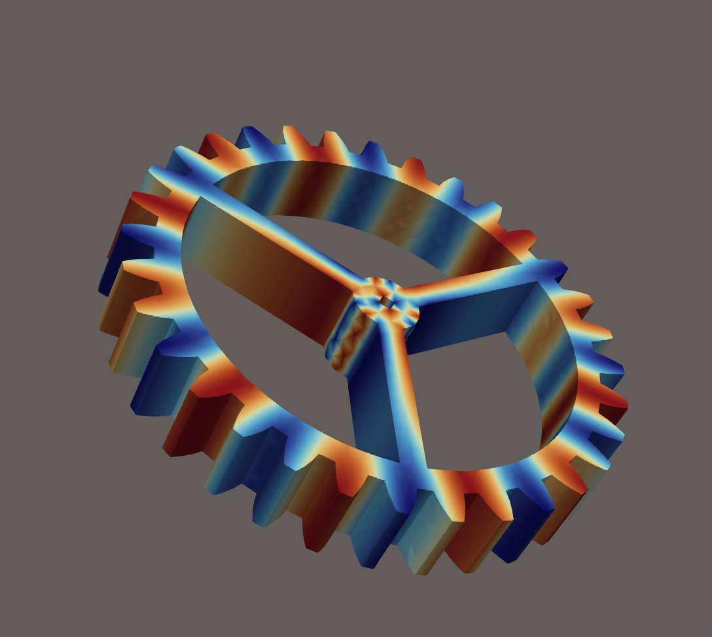
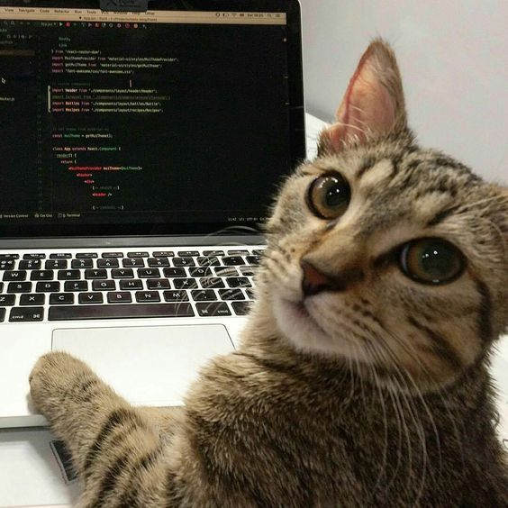

# Задание 2: Визуализация STL-модели с помощью VTK

В этой лабораторной я попробовала поработать с библиотекой **VTK** и посмотреть, как можно визуализировать процессы на объёмной сетке.

В качестве объекта я использовала **STL-модель шестерни** из прошлой лабораторной работы. Основная идея была не в том, чтобы считать какую-то реальную физическую задачу, а в том, чтобы задать на объекте простую функцию и движение, а затем визуализировать это в динамике.

---

## Что делает программа

Программа работает следующим образом:

1. Загружает STL-модель шестерни
2. С помощью **gmsh** строит внутри неё объёмную тетраэдральную сетку
3. На основе этой сетки создаётся структура данных для **VTK**
4. Задаётся движение объекта и функция, которая меняется во времени
5. Для каждого момента времени записывается файл формата **VTK**

В результате получается последовательность файлов `.vtu`, а также файл `.pvd`, который объединяет их в одну временную серию.

Эти файлы можно открыть в **ParaView** и посмотреть анимацию процесса.

---

## Движение объекта

Я задала для объекта простое движение.

Основное движение — **вращение шестерни вокруг оси Z**.

Кроме того, для некоторых точек сетки добавляется небольшая дополнительная деформация, которая меняется со временем. Благодаря этому объект выглядит немного более динамичным.

---

## Результат

После запуска программы создаётся папка

```
gear_output
```

в которой появляются файлы вида

```
gear-step-0000.vtu
gear-step-0001.vtu
...
gear.pvd
```

Файл **gear.pvd** открывается в **ParaView** и позволяет просмотреть анимацию.

---

## Визуализация в ParaView

Для визуализации я использовала стандартные инструменты ParaView.

В первом видео показан объект целиком в динамике — видно вращение шестерни.

Во втором видео используется фильтр **Slice**, который позволяет посмотреть внутреннюю структуру сетки. Сечение проходит через объект и показывает тетраэдральную сетку внутри.

---

## Видео

Для демонстрации результата я записала два коротких видео из ParaView.

- 🎥 [Обычная визуализация шестерни](https://youtu.be/y75TjXGp3co)  
  Показано вращение объекта и динамика сетки.

- 🎥 [Slice-сечение объекта](https://youtu.be/JpRjn7_2r2I)  
  Используется фильтр Slice, чтобы посмотреть внутреннюю структуру тетраэдральной сетки.

---

## Код

Основной файл программы:

💻 [code/result2.cpp](./code/result2.cpp)

Файл сборки проекта:

⚙️ [CMakeLists.txt](./CMakeLists.txt)

---

## Пример сетки

<p align="center">

</p>

---

<p align="center">


</p>

<p align="center"><i>Любая визуализация работает лучше, если рядом есть котик.</i> 🐱</p>